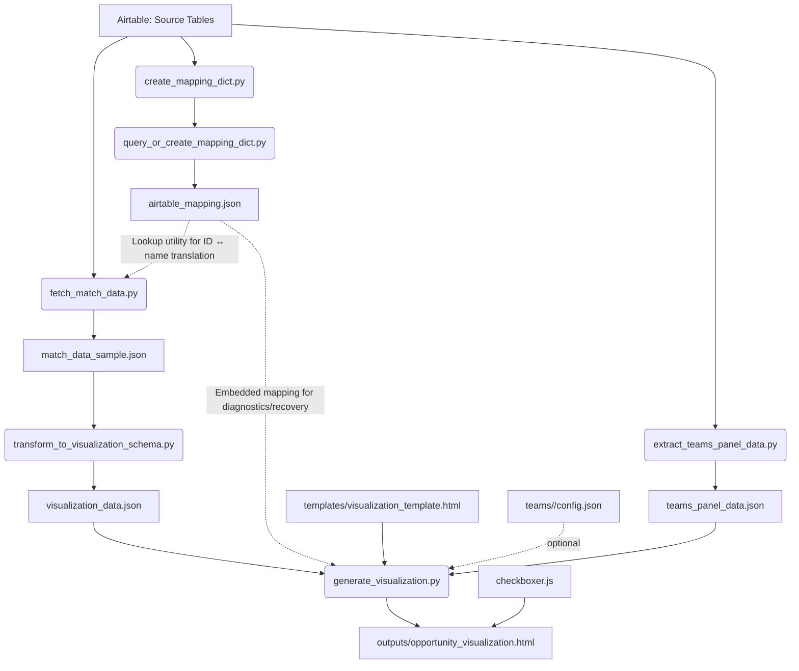

# Deprecated: See System/visualization/architecture/dataflow_theory_of_operation.md

This file has moved. Please refer to the new location for up-to-date dataflow and architecture documentation.

## Overview

This document provides a comprehensive, auditable map of the dataflow from Airtable to the final interactive visualization in GrantSeekerWeb. It is intended to support onboarding, debugging, and future architectural improvements.

---

## 1. Pipeline Narrative

### **Airtable → Canonical Mapping → Match Data → Visualization Data → HTML**

1. **Airtable**
    - Source of truth for Funders, Propositions, Teams, and Match Evaluation records.
    - Accessed via API using `pyairtable` and credentials in `.env`.

2. **Mapping Generation**
    - **Script:** `query_or_create_mapping_dict.py` (invoked via the wrapper `create_mapping_dict.py`)
    - **Output:** `airtable_mapping.json`
    - **Purpose:** Canonical mapping of record IDs to human-readable names (and vice versa) for Funders, Propositions, and Teams.
    - **Usage:** Required for all ID ↔ name translation tasks throughout the pipeline.

3. **Match Data Extraction**
    - **Script:** `fetch_match_data.py`
    - **Output:** `match_data_sample.json`
    - **Purpose:** Flat list of match evaluation records, each linking a funder to a proposition (and possibly a team), with scores and notes.
    - **Usage:** Canonical record of all many-to-many relationships for Funders and Propositions.

4. **Schema Transformation**
    - **Script:** `transform_to_visualization_schema.py`
    - **Output:** `visualization_data.json`
    - **Purpose:** Converts match data into the canonical plotting schema, computing derived fields (e.g., jittered coordinates for visualization).

5. **Teams Panel Data Extraction**
    - **Script:** `extract_teams_panel_data.py`
    - **Input:** Fetches all Teams and their linked propositions directly from Airtable via the API.
    - **Output:** `teams_panel_data.json`
    - **Purpose:** Extracts all Teams from Airtable, resolves each team's linked propositions, and generates a compact JSON file with team metadata and pre-decorated URLs for Teams panel buttons (using the new special token `all_funders`).
    - **Usage:** The JSON file is read by `generate_teams_panel_html_from_json.py` (called from `generate_visualization.py`) to inject the Teams panel into the visualization HTML. This enables robust, maintainable, and testable Teams panel logic decoupled from the main mapping pipeline.

6. **Visualization Generation**
    - **Script:** `generate_visualization.py`
    - **Inputs:** `visualization_data.json`, `airtable_mapping.json`, `templates/visualization_template.html`, `checkboxer.js`, `teams_panel_data.json`
    - **Output:** `outputs/opportunity_visualization.html`
    - **Purpose:** Injects all data and configuration into the HTML template, embeds mapping, generates Teams panel, and outputs the interactive visualization.
    - **Team-specific outputs:** Optionally, generates team-focused HTML using `teams/<team_name>/config.json`.

7. **Interactive UI**
    - **JavaScript:** `checkboxer.js` (embedded)
    - **Purpose:** Handles dynamic checkbox state, URL sync, and user interactivity in the browser.

---

## 2. Mermaid.js Dataflow Diagram

> **Node & Edge Explanations (Reference Table)**
>
> | Node/Edge | Explanation |
> |-----------|-------------|
> | **Airtable: Source Tables** | Source of truth for all Funders, Propositions, Teams, and Match Evaluation records. Accessed via API using credentials in `.env`. |
> | **create_mapping_dict.py** | Thin wrapper script that invokes `query_or_create_mapping_dict.py`. Required for pipeline orchestration and reproducibility. **Loss of this file would break the mapping pipeline.** |
> | **query_or_create_mapping_dict.py** | Core script that generates the canonical mapping between Airtable record IDs and human-readable names for all entities. **Loss of this file would break the mapping pipeline.** |
> | **airtable_mapping.json** | Canonical mapping file; used both for programmatic lookups and for embedding in the HTML for diagnostics/recovery. |
> | **fetch_match_data.py** | Extracts all Match Evaluation records from Airtable and outputs them as a flat list (`match_data_sample.json`). Uses the mapping for ID ↔ name resolution. **Loss of this file would break the data extraction pipeline.** |
> | **match_data_sample.json** | **Now canonical.** Originally a sample/extract, this file is now the complete list of all match evaluation records. It contains all Funder–Proposition (and possibly Team) relationships with scores and notes. |
> | **transform_to_visualization_schema.py** | Converts `match_data_sample.json` into plot-ready `visualization_data.json`, computing derived fields for plotting. **Loss of this file would break the data transformation pipeline.** |
> | **visualization_data.json** | Canonical, plot-ready data for the visualization. |
> | **generate_visualization.py** | Injects all data and config into the HTML template, embeds the mapping, and outputs the final interactive visualization. **Loss of this file would break the visualization generation pipeline.** |
> | **outputs/opportunity_visualization.html** | The final, interactive visualization for end-users. |
> | **checkboxer.js** | Provides dynamic checkbox and URL sync logic for the visualization UI. **Loss of this file would break UI interactivity.** |
> | **templates/visualization_template.html** | Master HTML template for the visualization. **Loss of this file would break HTML output.** |
> | **teams/<team_name>/config.json** | Optional team-specific config for default checkbox states. |
> | **extract_teams_panel_data.py** | Fetches all Teams and their proposition links directly from Airtable, outputs `teams_panel_data.json` for robust Teams panel generation. |
> | **teams_panel_data.json** | Canonical, auto-generated JSON file containing all Teams, their proposition links, and pre-built URLs for Teams panel integration. Used by the visualization pipeline to generate the Teams panel HTML. |
> | **D -. "Lookup utility for ID ↔ name translation" .-> E** | `airtable_mapping.json` is used as a programmatic lookup utility for stable, canonical ID ↔ name translation in all pipeline scripts. |
> | **D -. "Embedded mapping for diagnostics/recovery" .-> I** | `airtable_mapping.json` is embedded in the HTML output for diagnostics and potential recovery, enabling future debugging or mapping of UI state if IDs change. |
> | **M -. optional .-> I** | Team-specific config is optional and only used for team-focused HTML outputs. |
> | **A --> N** | Airtable data is fetched directly by `extract_teams_panel_data.py` for Teams panel generation. |

---

## 2a. Distinct Uses of `airtable_mapping.json`

### 1. **Lookup Utility: ID ↔ Name Translation**
- **Function:** Provides canonical, programmatic translation between Airtable record IDs and human-readable names for Funders, Propositions, and Teams.
- **Where Used:** All pipeline scripts (e.g., `fetch_match_data.py`, `generate_visualization.py`), utility functions (e.g., `airtable_id_name_utils.py`).
- **Purpose:** Ensures stable, auditable, and robust referencing of all records throughout the pipeline and UI, even if names change in Airtable.
- **Label in Diagram:** `airtable_mapping.json -. "Lookup utility for ID ↔ name translation" .-> fetch_match_data.py`

### 2. **Embedded Mapping for Diagnostics/Recovery**
- **Function:** Injects the `{Record Name: Record ID}` mapping into the final HTML output for diagnostics and potential recovery.
- **Where Used:** `generate_visualization.py` (injects mapping into HTML output).
- **Purpose:**
    - Enables diagnostics if record IDs in URLs/UI become missing or obsolete.
    - Supports recovery or debugging if Airtable IDs change (e.g., after migration).
    - Provides a transparent, human-readable mapping snapshot for future maintainers.
- **Label in Diagram:** `airtable_mapping.json -. "Embedded mapping for diagnostics/recovery" .-> generate_visualization.py`

---

## 3. Artifact and Script Roles

### **Scripts**
- `FreshVisualization.py`: Orchestrates the entire pipeline.
- `create_mapping_dict.py`/`query_or_create_mapping_dict.py`: Generates canonical ID↔name mapping.
- `fetch_match_data.py`: Extracts match records from Airtable.
- `transform_to_visualization_schema.py`: Converts match data to visualization schema.
- `generate_visualization.py`: Produces the final HTML visualization.
- `airtable_id_name_utils.py`: Utility for robust ID↔name lookups.
- `checkboxer.js`: UI logic for checkbox/URL sync.
- `extract_teams_panel_data.py`: Script to extract Teams data from Airtable, resolve proposition links, and generate `teams_panel_data.json` for Teams panel integration.
- `generate_teams_panel_html_from_json.py`: Reads `teams_panel_data.json` and generates Teams panel HTML for injection into the visualization.

### **Data Artifacts**
- `airtable_mapping.json`: Canonical mapping for all ID/name lookups.
- `match_data_sample.json`: Flat match records for all funder/proposition pairs.
- `visualization_data.json`: Canonical, plot-ready data.
- `outputs/opportunity_visualization.html`: Final interactive visualization.
- `templates/visualization_template.html`: HTML template.
- `teams/<team_name>/config.json`: Team-specific config (optional).
- `teams_panel_data.json`: Canonical, auto-generated JSON file containing all Teams, their proposition links, and pre-built URLs for Teams panel integration.

---

## 4. Canonical Sources and Diagnostics

- **Mapping Utility:** All ID ↔ name translation must use `airtable_mapping.json` and the associated utility.
- **Match Data:** The single source of truth for all many-to-many relationships (Funders↔Propositions) is `match_data_sample.json`.
- **Teams:** Team↔Proposition relationships are currently handled via mapping logic, not match data (see milestone for planned improvements).
- **Embedded Mapping:** The HTML output embeds the mapping for diagnostics and potential recovery.

---

## 5. Current Limitations & Areas for Improvement

- **Teams Mapping:** Many-to-many relationships for Teams↔Propositions are not yet handled as robustly as Funders↔Propositions.
- **Documentation:** This document should be updated with every architectural or data contract change.
- **Extensibility:** The pipeline is modular and can be extended to new entity types or relationships with minimal changes if guidelines are followed.

---

## 6. References
- See `README.md`, `stateful_checkbox_architecture.md`, and `System/milestone_changelog.md` for further details and project history.
- For authoritative development guidelines, see `mar17b architecture.md` (SD4D consultative approach).

---

*This document is canonical for onboarding, debugging, and future architectural decisions. Update it with every significant change to the dataflow or pipeline logic.*
